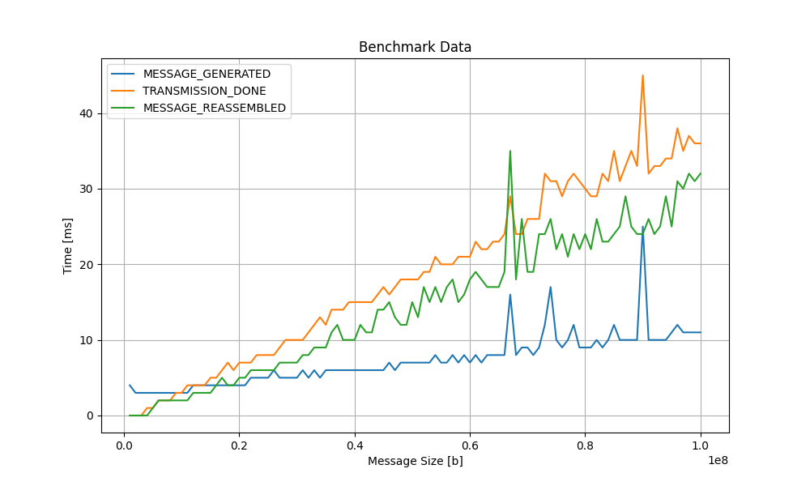

# Projekt: pakiety

> Igor Krzywda, 275480

## Specyfikacja

Projekt ma dwie części: transmisję i odbieranie wiadomości. Celem jest podzielenie wiadomości $M$ o długości $n$ bajtów na $p$ pakietów w transmitterze, które po symulowanym wysłaniu do modułu receivera zostaną przekonwertowane spowrotem na wiadomość $M$.

## Opis działania

### Packet

Wspólnym interfacem transmittera i receivera są pakiety zdefiniowane jako

```c
typedef struct {
  uint8_t payload[PAYLOAD_BUFFER_LENGTH];
  size_t message_length;
  size_t offset;
  size_t length;
  PacketType type;
} Packet;
```

Pakiet trzyma w sobie bufor na payload `payload`, długość całej wiadomości `message_length`, przesunięcie zawartości pakietu względem początku wiadomości `offset` oraz długość zawartości payloadu `length`.

### Transmitter

Transmitter enkapsuluje logikę dzielenia i wysyłania wiadomości w pakietach. Obiekt `TransmitterData` trzyma stan wysyłania wiadomości.

```c
typedef struct {
  const uint8_t *message_ptr;
  bool *packet_send_state;
  size_t message_length;
  size_t max_payload_length;
  unsigned int packet_count;
  uint8_t payload_buffer[PAYLOAD_BUFFER_LENGTH];
} TransmitterData;
```

Dane wskazywane z `message_ptr` są leniwie ładowane do `payload_buffer` przy wysyłaniu wiadomości.

#### Rozdzielanie wiadomości

`TransmitterData` jest tworzony per wiadomość, gdzie definiowana jest liczba pakietów oraz jest alokowana pamięć na bufor. Złozoność obliczeniową tej operacji mozemy przyjąć jako $\mathcal{O}(n)$ ze względu na liczbę pakietów jako `calloc` jest operacją liniową.

```c
int transmitter_init(TransmitterData *transmitter_data,
                     const uint8_t *const message, const size_t message_length,
                     const size_t max_payload_length) {
  /**/
  transmitter_data->message_ptr = message;
  transmitter_data->packet_count = message_length / max_payload_length +
                                   (message_length % max_payload_length > 0);
  transmitter_data->packet_send_state =
      (bool *)calloc(transmitter_data->packet_count, sizeof(bool));
  transmitter_data->message_length = message_length;
  transmitter_data->max_payload_length = max_payload_length;
  return SUCCESS;
}

```

#### Wysyłanie pakietu

Wysyłanie wiadomości przy zadanym indeksie kopiuje część wiadomości $M$ do bufora `payload_buffer` (operacja liniowa względem rozmiaru wycinka wiadomości). Po operacji kopiowania zakończonej sukcesem, wiadomość zostaje "wysłana", czyli zawartości bufora jest przekopiowana do bufora pakietu.

```c
int transmitter_send_data_packet(TransmitterData *const transmitter_data,
                                 const unsigned int packet_index,
                                 Packet *const packet) {
  / ** /
  size_t offset = packet_index * transmitter_data->max_payload_length;
  size_t length = transmitter_data->max_payload_length;
  if (packet_index == transmitter_data->packet_count - 1) {
    size_t last_packet_length =
        transmitter_data->message_length % transmitter_data->max_payload_length;
    length = last_packet_length == 0 ? transmitter_data->max_payload_length
                                     : last_packet_length;
  }

  int status_code = _copy_message_slice(
      transmitter_data->message_ptr, transmitter_data->message_length, offset,
      length, transmitter_data->payload_buffer); // operacja liniowa względem długości payloadu
  if (status_code != SUCCESS) {
    return status_code;
  }

  status_code = packet_init(packet, DATA, transmitter_data->message_length,
                            offset, length, transmitter_data->payload_buffer); // operacja liniowa względem długości payloadu
  if (status_code != SUCCESS) {
    return status_code;
  }

  transmitter_data->packet_send_state[packet_index] = true;
  return SUCCESS;
}
```

Z uwagi na ówczesne przyjęcie długości zbioru pakietów $P$ jako długość wiadomości $|M|$ na maksymalną długość payloadu pakietu $p_{max}$ i potrzebę przekopiowania zawartości pakietu dwa razy, złozoność obliczeniową mozna wyprowadzić następująco $\frac{|M|}{p_{max}} \cdot 2p_{max} = 2|M| = \mathcal{O}(|M|)$.

#### Złozoność obliczeniowa wysłania całej wiadomości

$2|M| + \frac{|M|}{p_{max}} = \frac{2}{p_{max}}|M| = \mathcal{O}(|M|)$

### Receiver

Receiver otrzymując wiadomość odkłada ją na stos, po otrzymaniu pakietu kończącego transmisję, wszystkie pakiety są zebrane ze stosu z ich payloadami przekopiowanymi w odpowiednie miejsca ówcześnie zaalokowanego buforu o długości wiadomości.

#### Stos

Stos jest zaimplementowany na tablicy dynamicznej ze stałą złozonością wkładania i ściągania elementu ze stosu o stałej złozoności. $l = \mathcal{O}(1)$, gdzie $l$ = `sizeof(Packet)`.

```c
typedef struct {
  int head_index;
  unsigned int capacity;
  Packet *data_buffer;
} Stack;
```

#### Otrzymywanie wiadomości

Otrzymywanie wiadomości jest wyłącznie dodaniem pakietu na stos. Zebranie całej wiadomości zajmuje $\frac{|M|}{p+{max}} \cdot l = \mathcal{O}(|M|)$, gdzie $l = const$.

#### Zrekonstruowanie wiadomości

Po ówczesnym zaalowokowaniu bufora o rozmiarze $|M|$, wiadomości ze stosu są ściągane dopóty, dopóki stos nie zostanie oprózniony. Długość stosu jest równa liczbie wiadomości ($|P| = \frac{|M|}{p_{max}}$). Kopiowanie zawartości pakietu zajmuje $\frac{|M|}{p_{max}}$, zatem złozoność obliczeniowa wynosi $\frac{|M|}{p_{max}} \cdot p_{max} = \mathcal{O}(|M|)$

#### Złozoność odebrania wiadomości

$\frac{|M|}{p_{max}} \cdot l + \frac{|M|}{p_{max}} \cdot p_{max} = \mathcal{O}(|M|)$

## Wyniki pomiarów

Pomiary zostały wykonane dla wielkości wiadomości od 1MB do 1GB.



Wykresy czasu operacji transmisji i odbierania wiadomości rosną z tendencją liniową.
